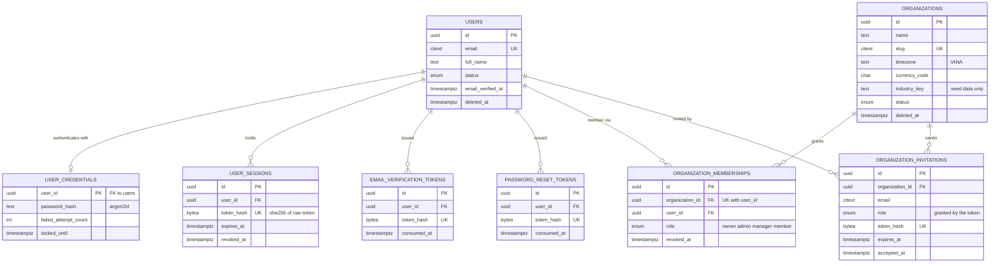
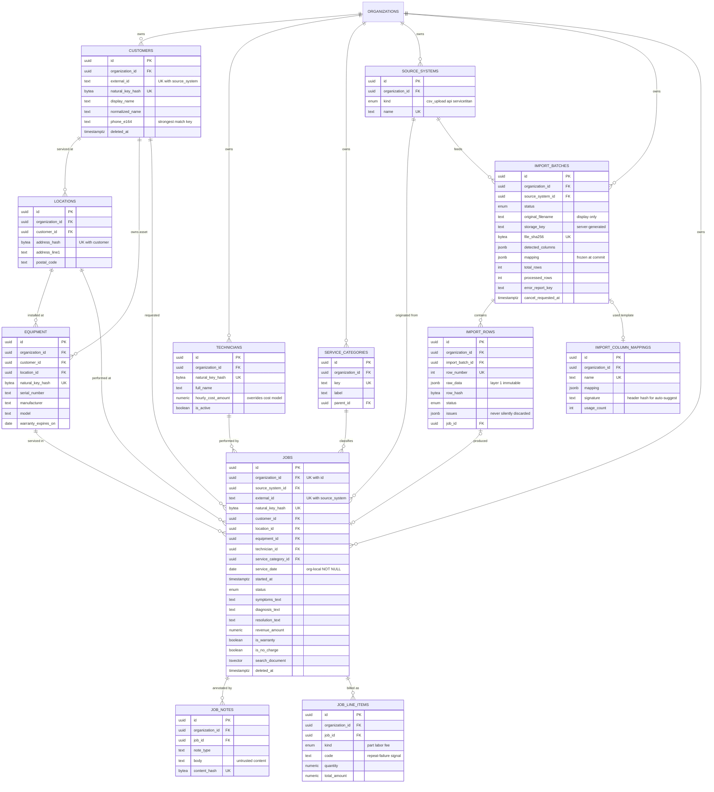
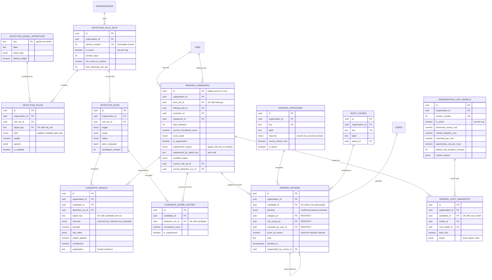

# 05 — Entity Relationship Diagrams

Four diagrams instead of one, because a single ERD across ~44 tables is unreadable and
therefore useless. Column lists are abridged to keys and identity-bearing fields; the complete
column specification is [04-data-model.md](04-data-model.md).

Legend: `PK` primary key, `FK` foreign key, `UK` participates in a unique constraint.

---

## 1. Identity & tenancy



The membership table is the **only** bridge between a person and tenant data. Note that
`ORGANIZATION_INVITATIONS` carries the role: accepting a token grants what the row says, never
what the request body says.

---

## 2. Operational data & ingestion



---

## 3. Detection, review & cost

The spine of the product. Note the deliberate separation: everything left of
`REWORK_CANDIDATES` is machine-generated and disposable; `REWORK_REVIEWS` and its category /
root-cause references are human truth and are never machine-written.



Two relationships to read carefully:

- `JOBS ||--o{ REWORK_CANDIDATES` appears **twice** — once as the prior visit, once as the
  follow-up. A single job is routinely both: the follow-up of one pair and the prior of the
  next.
- `REWORK_REVIEWS ||--o| REWORK_REVIEWS` is the reclassification chain. Rows are never updated;
  a changed decision inserts a new row and stamps `superseded_by_review_id` on the old one.

---

## 4. System & commercial

```mermaid
erDiagram
    ORGANIZATIONS ||--o{ BACKGROUND_JOBS : "queues work for"
    ORGANIZATIONS ||--o{ AUDIT_EVENTS : records
    ORGANIZATIONS ||--o| ORGANIZATION_SUBSCRIPTIONS : subscribes
    ORGANIZATIONS ||--o{ ORGANIZATION_ENTITLEMENT_OVERRIDES : "granted"
    ORGANIZATIONS ||--o{ USAGE_COUNTERS : meters
    ORGANIZATIONS ||--o{ BILLING_EVENTS : "receives"
    PLANS ||--o{ PLAN_ENTITLEMENTS : grants
    PLANS ||--o{ ORGANIZATION_SUBSCRIPTIONS : "subscribed to"
    USERS ||--o{ AUDIT_EVENTS : "acted as"
    USERS ||--o{ BACKGROUND_JOBS : enqueued
    BACKGROUND_JOBS ||--o| DETECTION_RUNS : "executes"
    BACKGROUND_JOBS ||--o| IMPORT_BATCHES : "processes"

    BACKGROUND_JOBS {
        uuid id PK
        uuid organization_id FK "null only for system jobs"
        text job_type
        jsonb payload
        enum status "queued processing completed failed cancelled"
        smallint priority
        timestamptz run_at "backoff schedule"
        int attempts
        int max_attempts
        timestamptz locked_at
        text locked_by
        timestamptz heartbeat_at "stale recovery"
        text idempotency_key UK
        boolean cancel_requested
        text correlation_id
    }
    AUDIT_EVENTS {
        uuid id PK "append-only"
        uuid organization_id FK
        enum actor_type "user system api_key"
        uuid actor_user_id FK
        text actor_label "survives user deletion"
        text action
        text resource_type
        uuid resource_id
        text summary
        jsonb changes "allowlisted fields only"
        text request_id
        bytea ip_hash
        timestamptz occurred_at
    }
    PLANS {
        uuid id PK
        text key UK "free pro business"
        text name
        numeric monthly_price_amount
        boolean is_public
    }
    PLAN_ENTITLEMENTS {
        uuid id PK
        uuid plan_id FK
        text entitlement_key "UK with plan"
        bigint limit_value "null means unlimited"
        boolean is_boolean
        enum period "month total"
    }
    ORGANIZATION_SUBSCRIPTIONS {
        uuid id PK
        uuid organization_id FK UK
        uuid plan_id FK
        enum status "trialing active past_due canceled"
        text billing_provider
        text provider_customer_id
        text provider_subscription_id
        timestamptz current_period_end
        boolean cancel_at_period_end
    }
    ORGANIZATION_ENTITLEMENT_OVERRIDES {
        uuid id PK
        uuid organization_id FK
        text entitlement_key "UK with org"
        bigint limit_value
        text reason
        timestamptz expires_at
    }
    USAGE_COUNTERS {
        uuid id PK
        uuid organization_id FK
        text metric_key
        date period_start "UK with org and metric"
        date period_end
        bigint value
    }
    BILLING_EVENTS {
        uuid id PK
        uuid organization_id FK
        text provider
        text provider_event_id UK "webhook idempotency"
        text event_type
        jsonb payload
        boolean signature_verified
        timestamptz processed_at
    }
```

---

## 5. Cross-diagram summary

| Relationship | Cardinality | Enforced by |
| --- | --- | --- |
| user ↔ organization | many-to-many | `organization_memberships`, unique on `(org, user)` where active |
| organization → all business data | 1-to-many | `organization_id NOT NULL` + RLS |
| job pair → candidate | 1-to-1 per ordered pair | `UNIQUE (organization_id, prior_job_id, followup_job_id)` |
| candidate → current review | 1-to-at-most-1 | `UNIQUE (candidate_id) WHERE superseded_by_review_id IS NULL` |
| candidate → signals | 1-to-many per run | `UNIQUE (candidate_id, detection_run_id, signal_key)` |
| organization → active rule set | 1-to-1 | `UNIQUE (organization_id) WHERE is_active` |
| organization → active cost model | 1-to-1 | `UNIQUE (organization_id) WHERE is_active` |
| organization → subscription | 1-to-1 | `UNIQUE (organization_id)` |
| candidate's jobs ↔ candidate's org | same-tenant guarantee | composite FK on `(organization_id, job_id)` |
